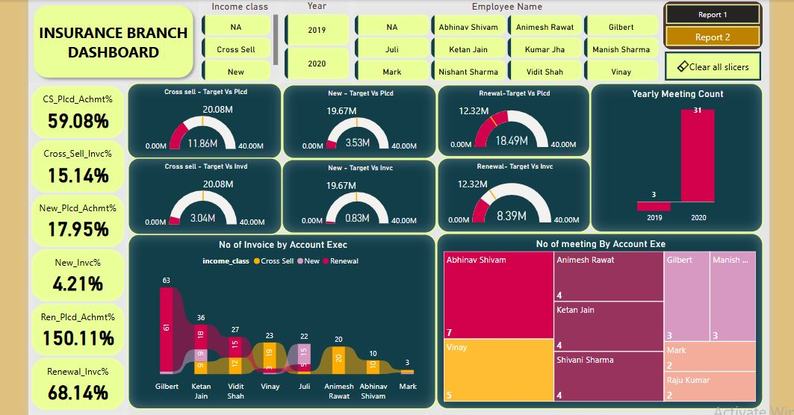
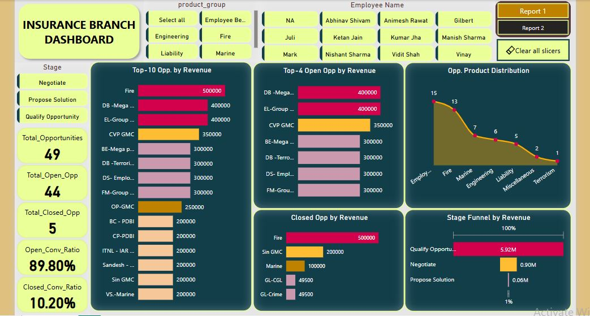

# 🧾 Insurance Branch Performance Dashboard – Power BI

## 📌 Overview  
This Power BI dashboard delivers an insightful, interactive analysis of **insurance opportunity performance** across policy types (Cross-Sell, New, Renewal). With built-in **bookmarks**, users can seamlessly switch between two reports:  
📘 **Report 1 – KPI Performance & Executive Analysis**  
📗 **Report 2 – Opportunity Revenue & Conversion Analysis**

The dashboard empowers stakeholders to monitor key KPIs, revenue stages, opportunity conversion rates, and employee-level metrics, all with the help of slicers, cards, gauges, and bar visuals.

---

## 🧠 Key Features

- Bookmarks to switch between multiple report views (Report 1 and Report 2)
- KPI Cards for Placement & Invoice Achievement by Policy Type
- Gauge Charts for Target vs Achieved vs Invoiced metrics
- Executive-level analysis: No. of Invoices and Meetings
- Top-N Opportunities by Revenue (Open, Closed, Overall)
- Stage Funnel with Revenue Distribution
- Product Group-wise Opportunity Distribution
- Slicers for: Income Class, Year, Employee Name, Product Group, Stage

---

## 📈 KPIs & Metrics Used

### 🚩 Report 1 – KPI & Executive Performance
- **Cross-Sell Placement Achievement:** 59.08%  
- **Cross-Sell Invoice Achievement:** 15.14%  
- **New Policy Placement Achievement:** 17.95%  
- **New Invoice Achievement:** 4.21%  
- **Renewal Placement Achievement:** 150.11%  
- **Renewal Invoice Achievement:** 68.14%  
- **Top Performer (Meetings):** Abhinav Shivam – 7  
- **Top Performer (Invoices):** Gilbert – 63

### 📊 Report 2 – Opportunity & Conversion Insights
- **Total Opportunities:** 49  
- **Total Open Opportunities:** 44  
- **Total Closed Opportunities:** 5  
- **Open Conversion Ratio:** 89.80%  
- **Closed Conversion Ratio:** 10.20%  
- **Top Revenue Opportunity:** Fire – ₹500K  
- **Top Product Group (by count):** Employee Benefits – 15

---

## 📊 Dashboard Snapshots

### 🧮 Report 1 – Placement & Executive Metrics

> Gauge charts for Cross-Sell, New, Renewal KPIs, bar charts for invoices & meetings, and yearly trends.

---

### 📈 Report 2 – Opportunity Funnel & Product Analysis

> Highlights top revenue opportunities, open vs closed breakdown, product distribution, and funnel stage revenue.

---

## 🔍 Key Insights

- **Renewal opportunities** are the best-performing category with **150.11% placement achievement**.
- **Cross-Sell** and **New policy invoices** remain significantly low — needs improvement in post-placement conversion.
- **Fire** is the most valuable policy in terms of revenue (₹500K).
- **Employee Benefits** lead in volume with 15 out of 49 total opportunities.
- Most meetings and invoices are contributed by **Abhinav Shivam** and **Gilbert**, respectively.
- Funnel data shows highest revenue in the **Qualify Opportunity** stage (₹5.92M).

---

## 🧰 Tools & Technology Used

| Tool / Feature        | Purpose                                                          |
|------------------------|------------------------------------------------------------------|
| **Power BI Desktop**   | Building interactive visual dashboards                           |
| **DAX Measures**       | Used for calculating KPIs, placement %, and revenue metrics      |
| **Bookmarks**          | Toggle between Report 1 and Report 2                             |
| **Gauge Charts**       | Target vs Achieved vs Invoiced visual tracking                   |
| **Custom Buttons**     | Navigation between reports and clearing filters                  |
| **Slicers**            | Multi-level filtering by class, product, employee, and year      |
| **Treemap & Bar Charts** | Visualizing meetings, invoices, funnel stages, and opportunities |

---

## 📁 Data Fields Used

- Employee Name  
- Income Class (Cross-Sell / New / Renewal)  
- Target Amount  
- Achieved Amount  
- Invoice Amount  
- Product Group  
- Opportunity Stage  
- Meeting Count  
- Invoice Count  
- Year  

---

## 🔁 Interactivity & Navigation

- 🎛️ **Report Bookmarks**: Easily toggle between two visual reports  
- 🎚️ **Dynamic Filters**: Slicers for stage, product, year, employee  
- 📈 **Visual KPIs**: Gauge charts for instant comparison of targets vs actuals  
- 🗂️ **Buttons**: For navigation and clearing slicers  

---

---

## 📌 Tags

`#PowerBI` `#InsuranceAnalytics` `#InteractiveDashboard` `#DAX` `#Bookmarks` `#KPIs` `#ExecutivePerformance` `#RevenueFunnel` `#OpportunityTracking`

---

## 👤 Author

**Syed Yaseen**  
*Aspiring Data Analyst | Power BI | Excel | SQL | Tableau*

- 
- 

